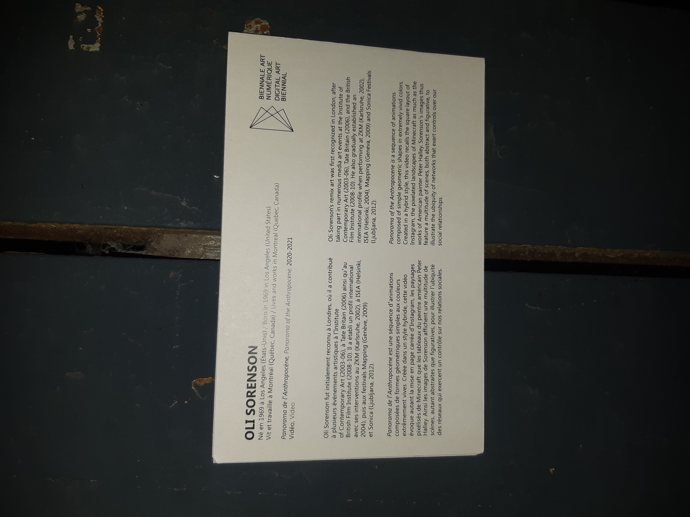

# Panorama de l'Anthropocène

Date de visite: 02/10/22

### Artiste: 

Oli Sorenson

#### Exposition

Nom: *BIAN 2021*

Lieu: *Arsenal art contemporain, Montréal*

## Description de l'oeuvre

Le Panorama de l'Anthropocène est une oeuvre qui à été réalisée en 2020/2021. À l'origine, chaque images était leurs propre oeuvre numérique, elles ont ensuite été transposées en plusieurs médias, dont l'animation qui était présente à la BIAN, où nous avons pu voir l'oeuvre. L'oeuvre est une version animée des tableaux originaux, avec des igénieuses transitions entre eux. La pièce est majoritairement composée de formes géométriques primaires. Majoritairement de triangles, carrés et rectangles. Elles portent un message sur la consommation dans notre société.

