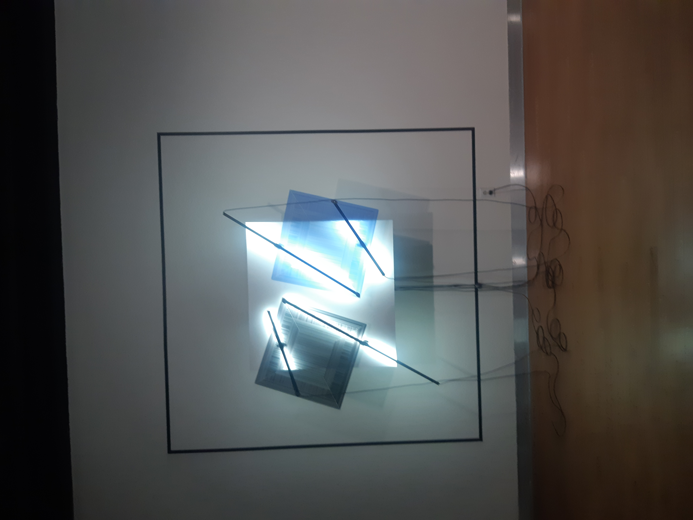
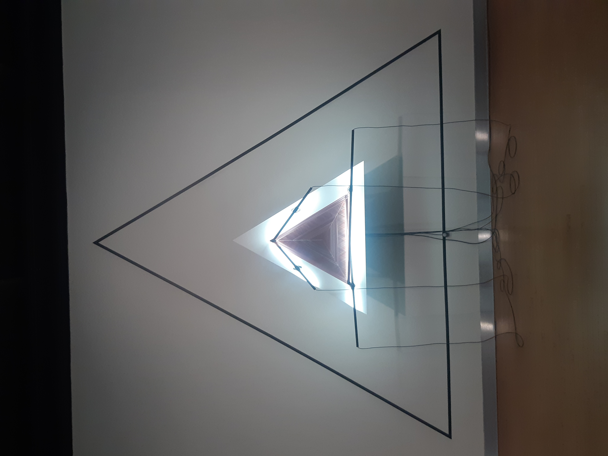
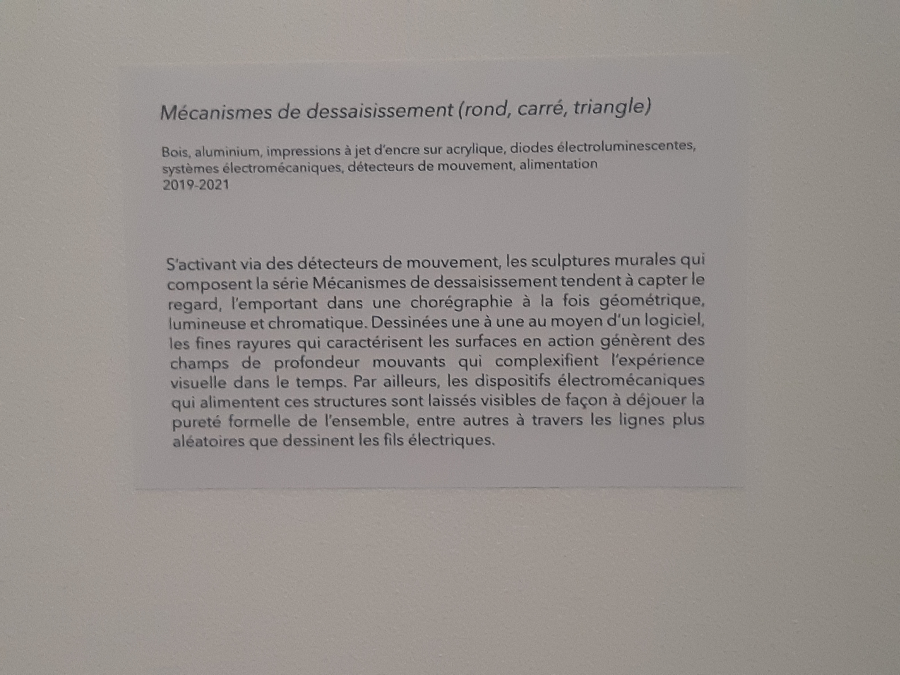
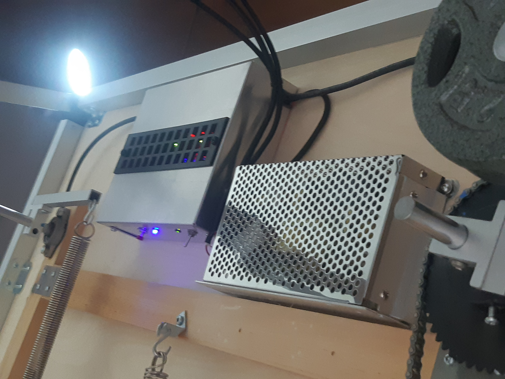
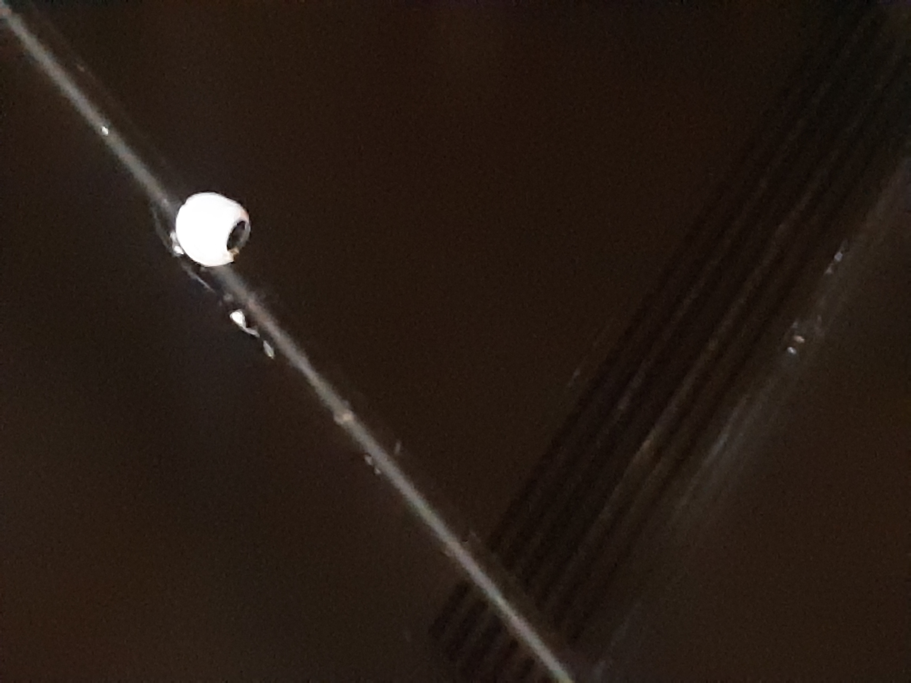
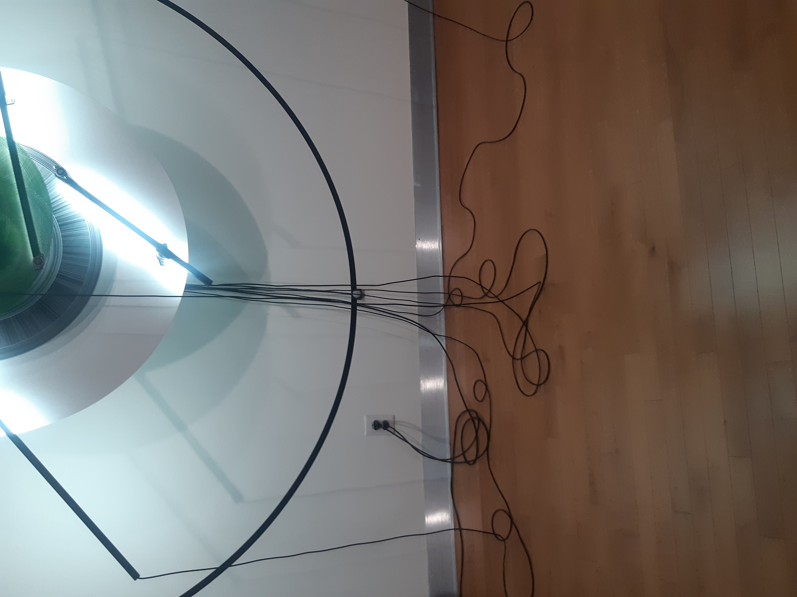

# *Méchanisme de Déssaisissement*

   

## Artistes

Duo Béchard-Hudon

## Année de création

2019-2021

 

## Exposition

*Configuration du sensible*

## Emplacement de l'oeuvre

Maison des Arts, Laval, Québec

## Date de visite

2022-03-17

## Matériels utilisés pour la création de l'oeuvre

L'oeuvre est composée de: bois, aluminium, d'impressions à jet d'encre sur acrylique (Les carrés, triangles et cercles), diodes électroluminescentes (Lumières présentes sur les oeuvres), 

un système électromagnétique (Ce qui permet le mouvement des formes), d'un système d'alimentation.

 

et de détecteurs de mouvements (L'oeuvre n'est pas active lorsque personne est dans la salle) 

Les sculptures mesurent: 244 x 244 x 76cm (carré et cercle) et 345 x 345 x 76cm (triangle)

>Source: [Site des artistes](https://bechardhudon.com/project/mecanismes-de-dessaisissement-rond_divestment-mechanisms-round_2021/)

## Description de l'oeuvre

L'oeuvre est composé de 3 sculptures cinétiques, chacunes étant composés de lumières LED ainsi que 2 formes géométriques chacunes: carrés, cercles et triangle, l'une des deux formes est noire. Ces formes vont exécuter une performance qui dure plus ou moins une heure lorsque quelqu'un s'approche d'elles. Cette performance consiste des deux formes présentes sur la structure ce déplacant des manière qui est visiblement aléatoire, mais qui est entièrement programmé. Les cables ainsi que les machines nécéssaire à la fonction des oeuvres sont laissés volontairement à la vue de tous.

