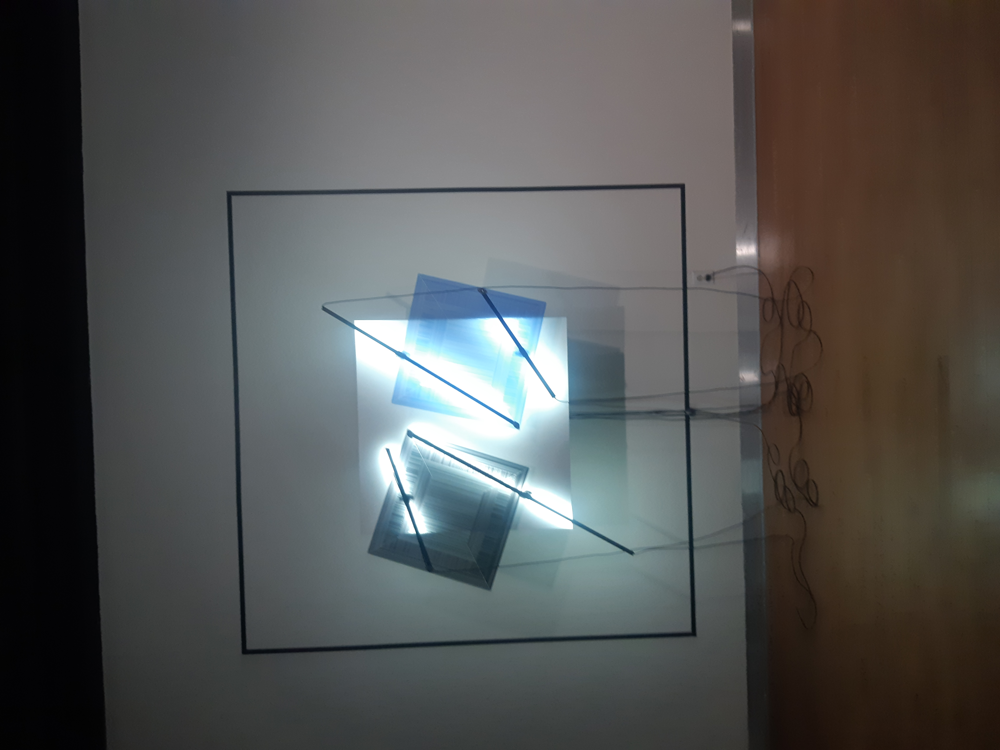
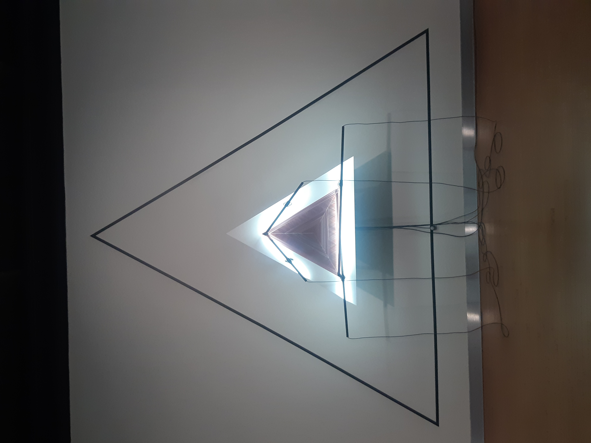
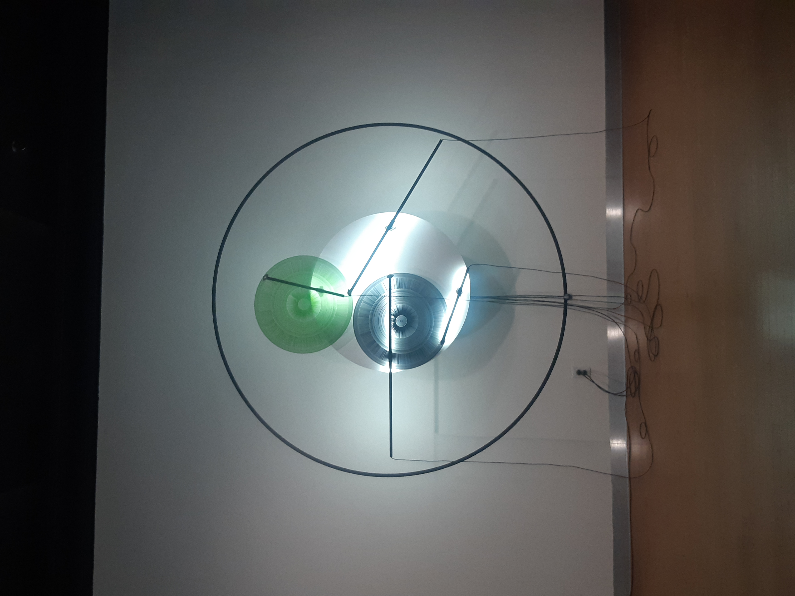
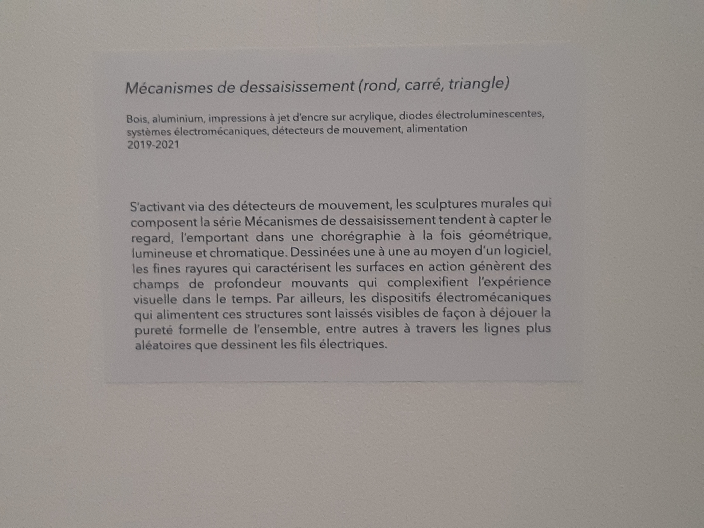
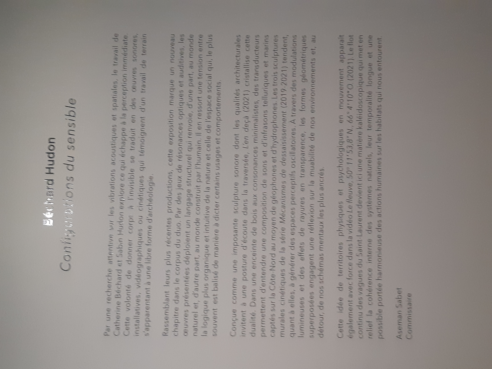
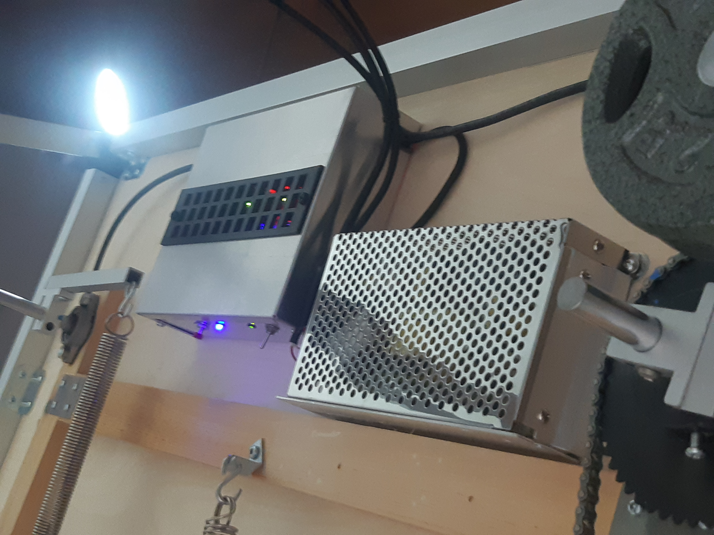
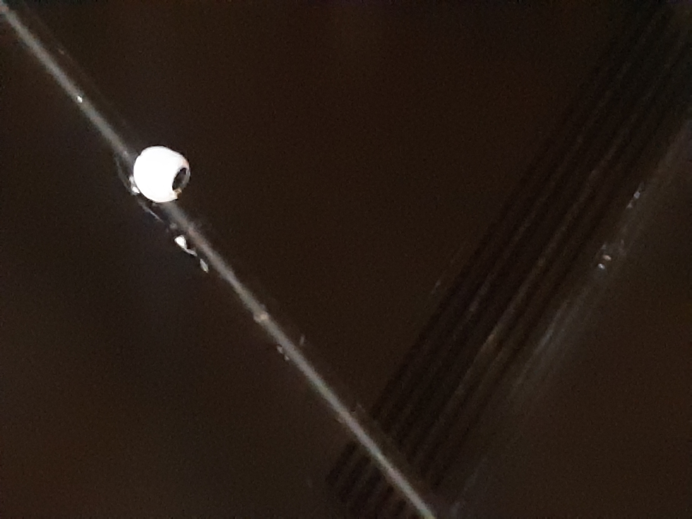
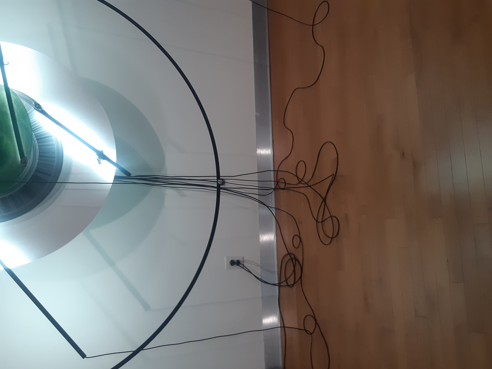
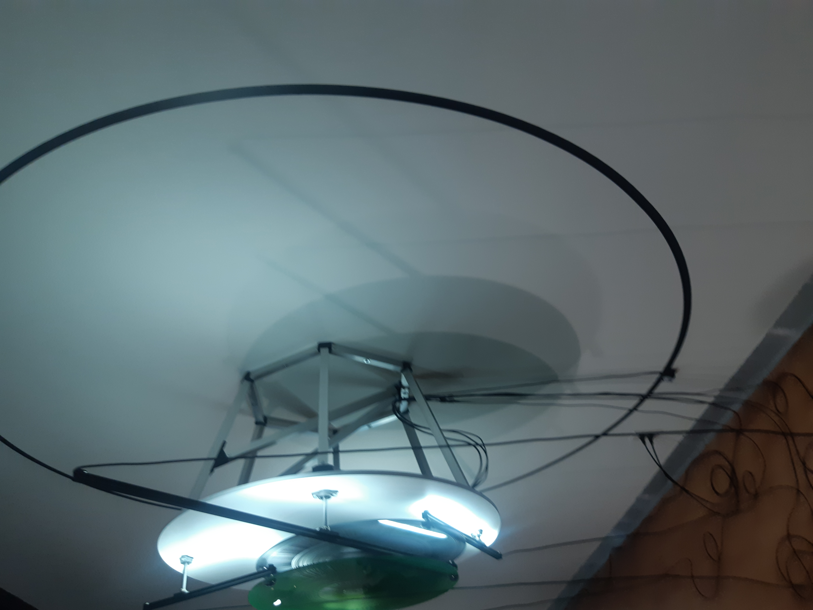
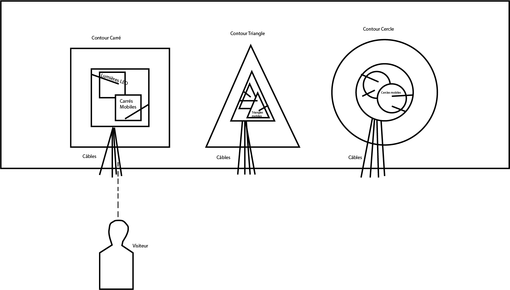

# *Méchanisme de Déssaisissement*

   

 

## Artistes

Duo Béchard-Hudon

## Année de création

2019-2021

## Exposition

*Configuration du sensible*

## Emplacement de l'oeuvre

Maison des Arts, Laval, Québec

## Date de visite

2022-03-17

## Matériels utilisés pour la création de l'oeuvre

L'oeuvre est composée de: bois, aluminium, d'impressions à jet d'encre sur acrylique (Les carrés, triangles et cercles), diodes électroluminescentes (Lumières présentes sur les oeuvres), 

un système électromagnétique (Ce qui permet le mouvement des formes), d'un système d'alimentation.

 

et de détecteurs de mouvements (L'oeuvre n'est pas active lorsque personne est dans la salle) 

Les sculptures mesurent: 244 x 244 x 76cm (carré et cercle) et 345 x 345 x 76cm (triangle)

>Source: [Site des artistes](https://bechardhudon.com/project/mecanismes-de-dessaisissement-rond_divestment-mechanisms-round_2021/)

## Description de l'oeuvre

L'oeuvre est composé de 3 sculptures cinétiques, chacunes étant composés de lumières LED ainsi que 2 formes géométriques chacunes: carrés, cercles et triangle, l'une des deux formes est noire. Ces formes vont exécuter une performance qui dure plus ou moins une heure lorsque quelqu'un s'approche d'elles. Cette performance consiste des deux formes présentes sur la structure ce déplacant des manière qui est visiblement aléatoire, mais qui est entièrement programmé. Les cables ainsi que les machines nécéssaire à la fonction des oeuvres sont laissés volontairement à la vue de tous.

 

## Mise en place de l'oeuvre

Voici un croquis de la mise en place de l'oeuvre:

 

## Éléments nécéssaire à l'exposition

1. Détecteurs de mouvement
2. Mur suffisement grand pour accueillir les 3 sculptures

## Expériences personnelles

Lorsque je suis entré dans la salle, j'ai automatiquement été intrigué par ces amas de formes sur les murs, je n'ai d'ailleurs pas tout de suite remarqué qu'elles bougaient. J'étais intéressé par les ombres qui étaient crées par la composition, j'ai regardé chacunes des scupltures sous plusieurs angles afin de voir si les ombres allaient changer. Lorsque je j'ai réalisé que les formes bougaients, j'ai voulu voir comment est-ce que cela fonctionnait, plus je regardait ces scupltures, plus j'étais intéressé.

### Élément que je retiens

Avoir un élément physique constament en mouvement pourrait être intéressant à faire dans une autre oeuvre. J'ai l'impression que si quelque chose bouge dans la réalité, ça a plus d'impact que sur un écran car les gens ne s'y attendent moins.

### Élément que je ne retiens pas

Dans mes oeuvres, je préférerai cacher les fils plutôt que de les laisser visible au public, car même si on demande au public de ne pas toucher, les chances que quelqu'un n'écoute pas ou ait un accident sont très hautes, et j'aimerai éviter de laisser quelque chose aussi fragile que des cables sans protections.
