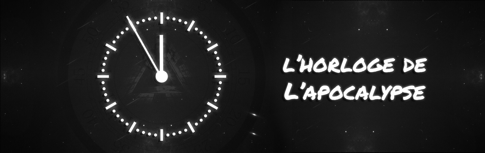
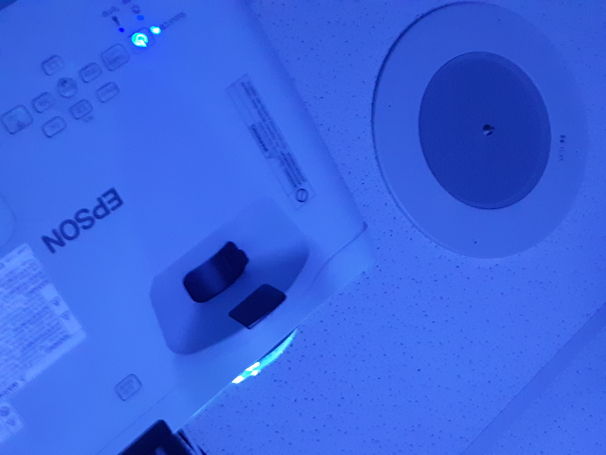
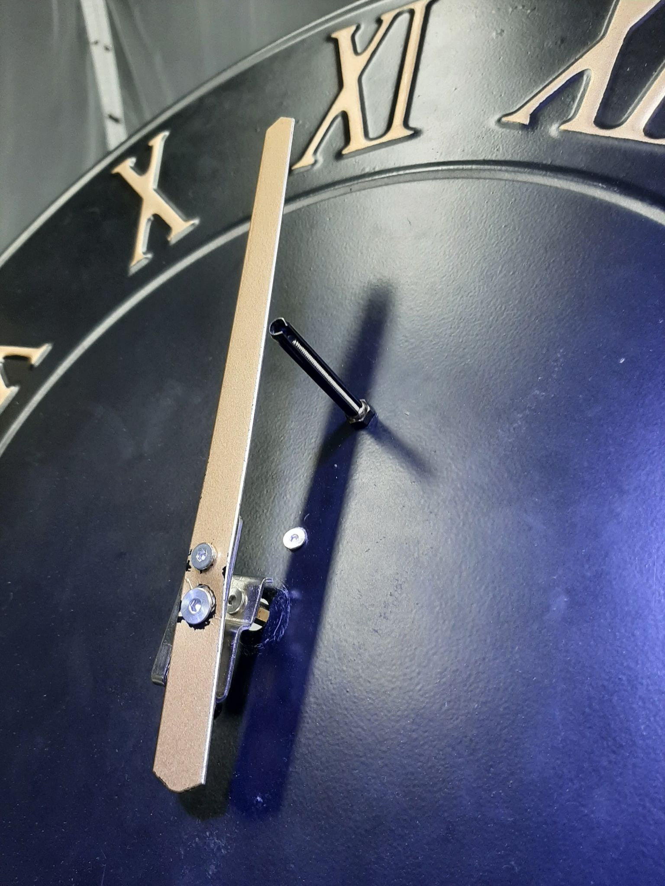
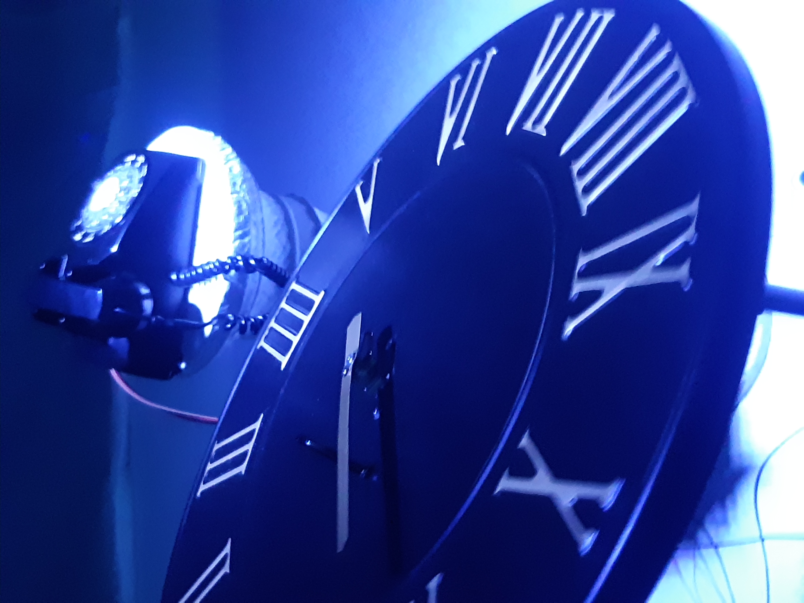
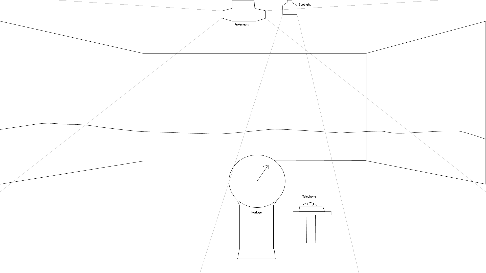

# *L'Horloge de l'Apocalypse*

## Artistes

Maxime Sabourin, Louis-Phillipe Gravel, Alexis Lacasse, Tristan Girard-Montpetit et Maxime De Falco

## Années de création

2021-2022

## Exposition

*Moebius*

## Emplacement de l'oeuvre

Petit studio TIM, collège Montmorency.

## Date de visite

24 mars, 2022

## Éléments utilisés pour la création de l'oeuvre

L'oeuvre est composée de: 1 horloge équipée d'un potentiomètre à 12 coches, 1 téléphone à cadran, 2 micro-ordinateur raspery PI, 3 projecteurs, 1 kinect, 11 bandes son, 11 compositions vectorielles, 2 piédestal, 4 speakers, 1 spotlight, 1 ordinateur.

## Description de l'oeuvre

L'oeuvre est composée d'une salle dans laquelle des toiles sont posées sur 3 des murs, sur ces toiles se trouve une composition en vectoriel représentant une étape de l'histoire humaine. Il y a en tout 11 de ces compositions, chacunes avec une bande son différente. Ces compositions changent lorsque l'interacteur tourne l'aiguille de l'horloge présente au centre de la salle sur un piédestale. Les compositions sont animées et illustre l'humanitée de son début à sa fin. L'interacteur est libre de tourner l'aiguille en avant ou vers l'arrière aussi longtemps qu'il veut, jusqu'à ce qu'il arrive à 12h, à ce moment à la place d'une composition, il y aura un message disant que notre monde pourrait finir comme la douxième heure si nous n'agissont pas. Le téléphone à côté du piédestale va alors se mettre à sonner, avec un appel pré-enregistré de l'autre côté de la ligne. Celui-ci nous encourageant de se mettre à agir également. L'intéracteur ne peut pas passer directement de l'heure 1 à l'heure 12 à cause d'une barrière physique présente entre les deux. À la fin de l'expérience, il est demandé à l'interacteur de replacer l'aiguille sur l'heure 1. Lorsque l'intéracteur entre dans la salle, la vidéo d'introduction de l'oeuvre joue. Ceci est calibré

             

>Source de la première image: [Page de l'oeuvre](https://tim-montmorency.com/2022/projets/L-horloge-de-l-apocalypse/docs/web/index.html)

## Éléments nécéssaires à l'exposition de l'oeuvre.

1. 3 Projecteurs
2. 1 Détecteur de mouvements
3. 4 Hauts-Parleurs
4. 1 Ordinateur

## Mise en place de l'oeuvre

Voici un croquis de la mise en place de l'oeuvre:

## Expériences personnelles

Lorsque j'ai bougé l'aiguille pour la première fois, j'ai tout de suite voulu savoir comment le méchanisme fonctionnait, j'était intrigué par le fonctionnement car l'interaction a eu un impact direct sur la l'environement autours de moi, j'ai bien apprécié les animations car elles étaient simple mais complètes. La transition entre les deux animations et bandes sons est instantanée lorsqu'on tourne l'aiguille, ce qui est très impressionant. Ensuite, le téléphone, je ne sais pas exactement comment ils ont reprogrammé le téléphone afin qu'il sonne et diffuse l'appel préenregistré, mais celui-ci s'est déclenché exactement au moment où il était voulu. J'ai bien aimé avoir l'expérience de cette oeuvre et l'équipe derrière était très ouverte à propos du fonctionnement. Lorsque j'ai demandé comment ça fonctionnait, un des membres m'a dit de le suivre et nous a montré exactement comment l'horloge fonctionnait.

## Choses à retenir

L'interactivitée présente dans *l'Horloge de l'Apocalypse* est son point le plus fort, car ce n'est pas l'oeuvre qui dicte à l'interacteur quoi faire, mais l'interacteur qui décide lui-même, éventuellement il faut absolument arriver à la dernière heure, mais il n'y a pas de temps limite pour le faire. Ce que je vais retenir, c'est donner le contrôle à l'intéracteur sur comment il va intéragir avec l'oeuvre.

## Choses à ne pas retenir

Lorsque l'on tournait l'aiguille de l'horloge, ce n'était pas très doux, c'était dur et à chaque fois j'avais peur de briser l'aiguille, dans mes oeuvres je vais essayer d'utiliser des éléments qui parraîssent plus robuste.

## Classement des oeuvres après expérience.

1. *L'Horloge de l'Apocalypse*
2. *Chère Sasha*
3. *Chronauffrage*
4. *Distortion Collective*
5. *Jeu Temporel*
6. *3 Minutes*

### 1: *L'Horloge de l'Apocalype*

*L'Horloge de l'Apocalypse* est positionnée en première position car c'était elle qui avait ce que j'estime le plus important dans une oeuvre multimédia, de l'interactivité mêlant le code et la réalité. Le sentiment d'avoir le contrôle sur ce qui était présent sur les murs lorsque l'on faisait tourner l'aiguille est la chose que j'ai le plus apprécié de tout les oeuvres. *l'Horloge de l'Apocalypse* reste en première position à cause de sa prémisse intéressante et son intéractivitée.

### 2: *Chère Sasha*

*Chère Sasha* est probablement l'oeuvre la plus complète des 6, la seule raison qu'elle n'est pas en première place est celle de l'interactivitée, même si il y en a dans *Chère Sasha*, elle est moins intéressante que celle dans *l'Horloge de l'Apocalypse*. Cette oeuvre est la plus complète à cause de son décor, celui-ci étant une chambre complète, avec beaucoup d'éléments avec lesquels intéragir. Le plus intéressant d'après moi était le journal, car celui-ci était quasiment rempli, même si il est peu probable que quelqu'un va lire le journal complet, il est quand même quasiment plein, ça c'est de la dédication. *Chère Sahsa* passe de la cinqième position à la seconde car elle réussit à faire l'idée qu'elle donnait, ce que j'avais pensé trop compliqué.

### 3: *Chronauffrage*

*Chronauffrage* reste dans mon top 3 pour la même raison que pour ma liste avant la visite, le style artistique des portraits. Un problème que j'ai eu pendant que j'ai expérimenté l'oeuvre est que la détection de mouvement ne fonctionnait pas parfaitement si on ne faisait pas exactement ce qui nous était demandé.

### 4: *Distortion Collective*

*Distortion Collective* reste en quatrième place. J'ai bien aimé l'expérience mais comme il n'y avait pas vraiment d'intéractivité en dehors du monde virtuel, elle n'était pas aussi intéressante que les autres oeuvres.

### 5: *Jeu Temporel*

*Jeu Temporel* passe de la seconde place à la cinquième ce qui est ironique, car j'ai monté *Chère Sasha* à cette position car l'oeuvre accomplissait ce qui était dit, la raison de pourquoi *Jeu Temporel* a pris cette position est parce qu'ils ont fait l'opposé, même si le jeu fonctionne, il manquait beaucoup d'intéractions, il n'y a que deux possibles résultats à chaques questions: bonne réponse et mauvaise réponse, mais une seule ligne est enregistrée pour la mauvaise réponse, ce qui mène des fois à des incohérences car la ligne de mauvaise réponse mentionne que tu a pris une certaine réponse alors que ce n'est pas le cas. Cela brise l'immersion et est la raison pourquoi l'oeuvre est aussi basse dans le classement.

### 6: *3 Minutes*

La seule raison pourquoi *3 Minutes* est en sixième position est que je ne l'ai pas expérimenté. La raison pour ceci est que je n'ai jamais eu la chance de le faire et ma clostrophobie. Comme j'ai mentionné dans ma première liste, comme je suis closrophobe je n'était pas vraiment entraîné par l'idée d'être dans un casier. La prémisse de l'oeuvre reste tout de même intéressante et j'ai entendu des personnes qui l'ont expérimentés qu'elle était bien faite.
