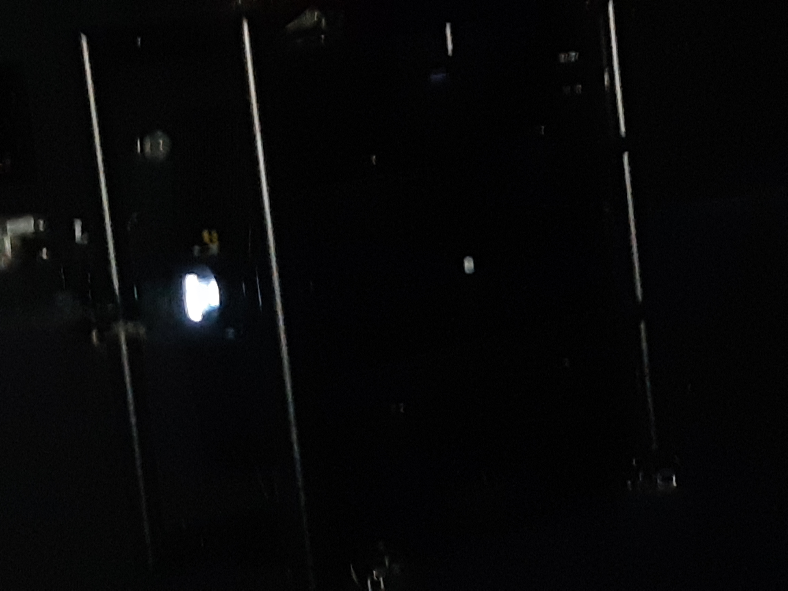
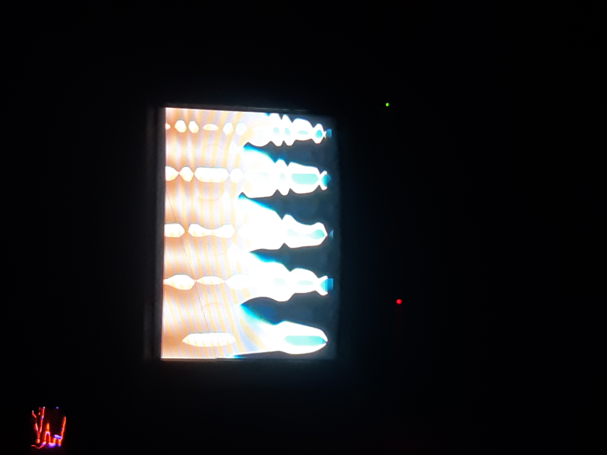
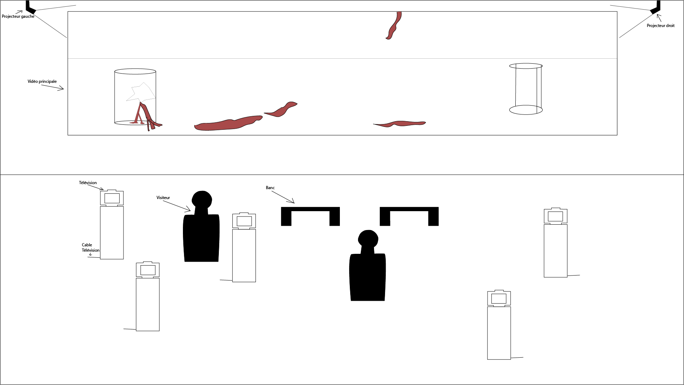
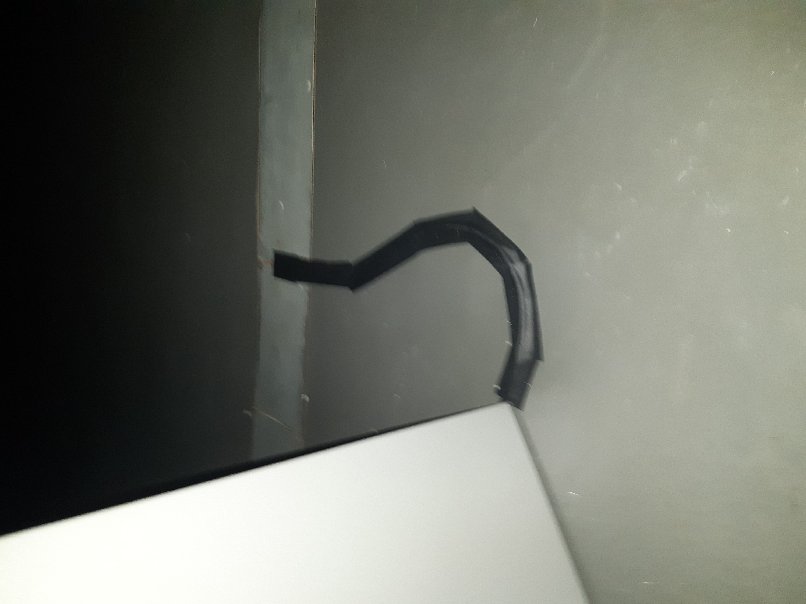

# *House of Skin*

## Artistes

Sabrina Ratté et Roger Teller-Craig

## Année de réalisation

2020

## Date de visite

03/02/22

## Lieu d'exposition

Cinémathèque Québécoise

## Description

*House of Skin* est une oeuvre mettant en scène une vidéo de 10 minutes dans laquelle on voit des modèles en 3 dimensions de ce qu'on peut assumer être de la chair humaine ayant vécu des choses inimaginables. Cette vidéo peut être décrite comme "gore". Elle est le coeur de l'oeuvre et est projetée sur le mur à l'aide de deux projecteurs

. elle est également accompagnée de d'autres vidéos, celles-ci étant sur 5 télévisions catodiques. Affichant une boucle similaires à un glitch.

L'ambiance générale de l'oeuvre est glauque et tente de rendre le visiteur incomfortable.

## Éléments nécéssaires pour l'exposition

1. 5 télévisions catodiques
2. fichier vidéo principal
3. fichiers vidéos des télévisions
4. bande sonore
5. 2 projecteurs

## Mise en place de l'oeuvre

Voici un croquis de la mise en place de l'oeuvre:

## Expériences personnelles

Lorsque je suis entré dans la salle, la première chose qui m'a pris par surprise était l'ambiance, la bande sonore à été parfaitement composée pour créer une ambiance dans laquelle le visiteur ce sens très incomfortable. La salle était très petite alors tout paraîssait imposant, par exemple, la vidéo principale faisait la longeur du mur du fond quasiment au complet. Cela donnait aussi à la bande sonore une sorte d'écho qui résonnait très bien. La salle était très sombre ce qui bien sûr rajoutait à l'ambiance. L'addition des télévisions couvrait le vide du centre de la salle, mais il n'y avais pas réelement de connections entre elles et la vidéo principale. Les caches-fils pour ceux-ci étaient d'ailleurs composés seulement de ruban adhésif. En résumé, l'expérience était bonne, surtout la trame sonore, mais il y a certaines parties de l'oeuvres qui auraient pu ne pas être présentes et l'expérience n'aurait pas réelement souffert.

