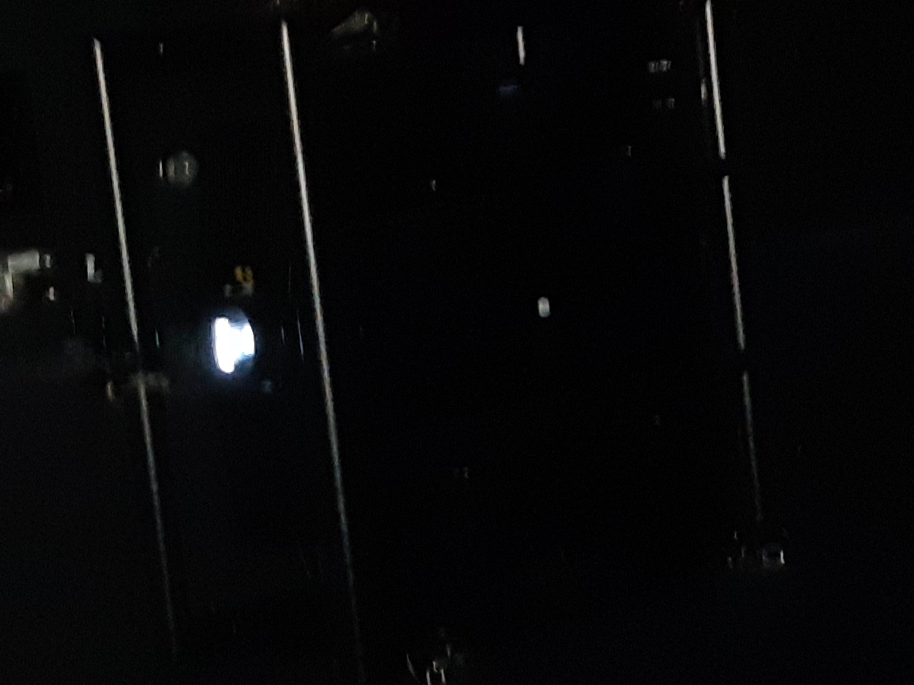
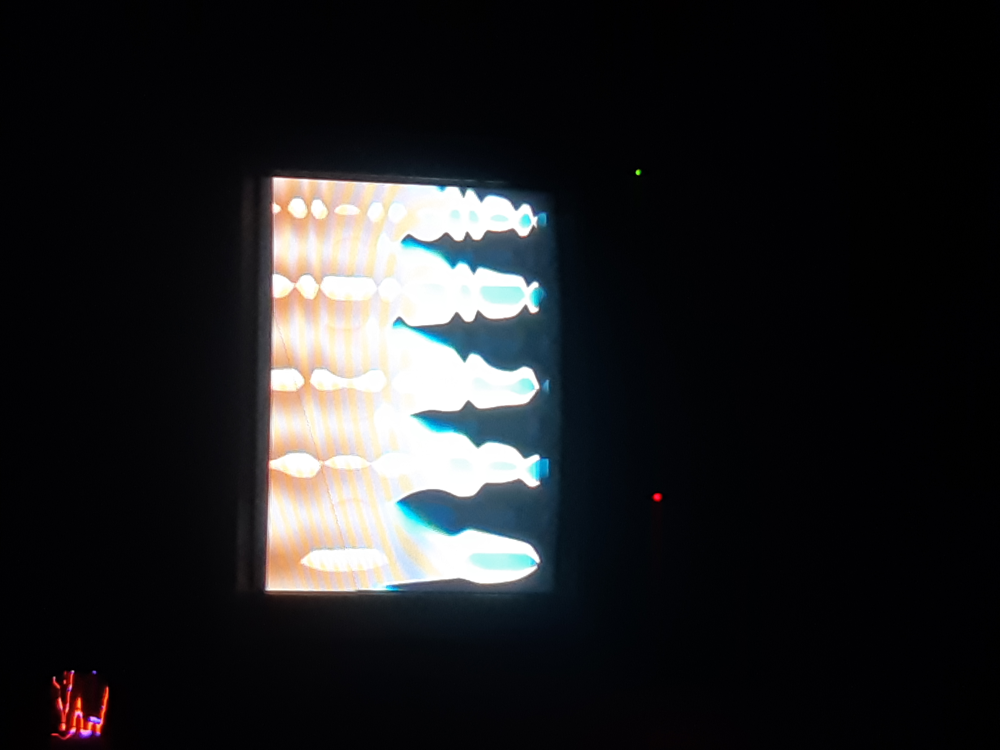
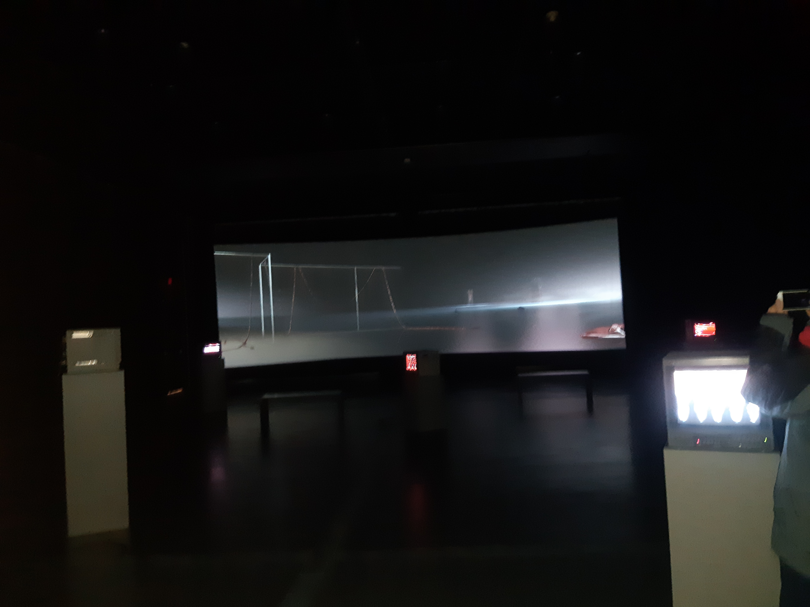
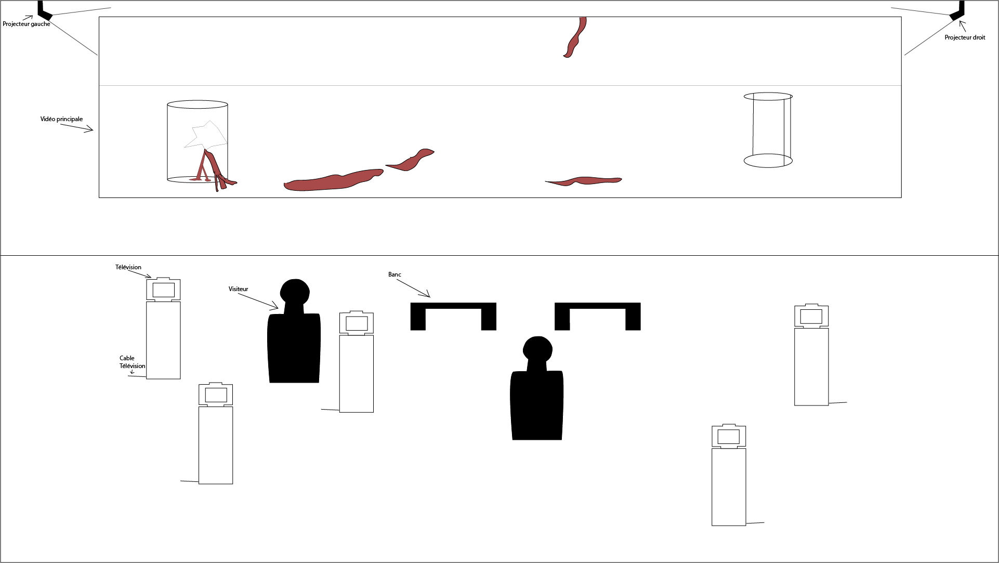
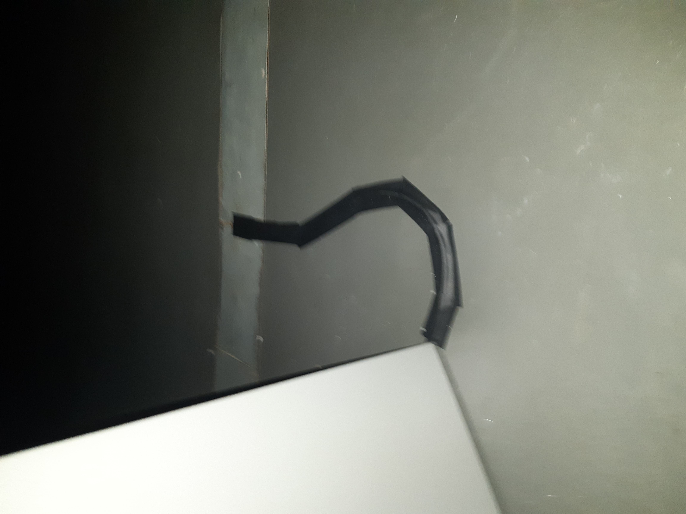
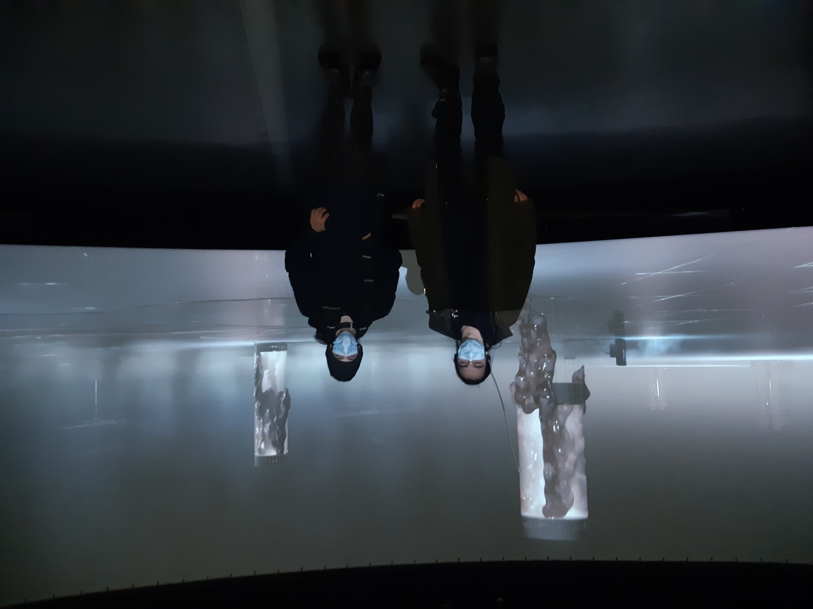

# *House of Skin*

## Artistes

Sabrina Ratté et Roger Teller-Craig

## Année de réalisation

2020

## Date de visite

03/02/22

## Lieu d'exposition

Cinémathèque Québécoise

## Éléments utilisés pour l'oeuvre

2 projecteur, 5 télévisions catodiques, 5 fichiers vidéos pour télévisions, 1 fichier vidéo pour projecteur, 1 bande son, 4 hauts-parleurs pour bande son.

## Description

*House of Skin* est une oeuvre mettant en scène une vidéo de 10 minutes dans laquelle on voit des modèles en 3 dimensions de ce qu'on peut assumer être de la chair humaine ayant vécu des choses inimaginables. Cette vidéo peut être décrite comme @gore". Elle est le coeur de l'oeuvre et est projetée sur le mur à l'aide de deux projecteurs.

Elle est également accompagnée de d'autres vidéos, celles-ci étant sur 5 télévisions catodiques. Affichant une boucle similaires à un glitch.

L'ambiance générale de l'oeuvre est glauque et tente de rendre le visiteur incomfortable.

## Éléments nécéssaires pour l'exposition

1. 5 télévisions catodiques
2. 2 projecteurs
3. 4 haut-parleurs
4. Tout cables nécéssaires à l'installation des objets mentionnés ci-dessus

## Mise en place de l'oeuvre

Voici un croquis de la mise en place de l'oeuvre:

## Expériences personnelles

Lorsque je suis entré dans la salle, la première chose qui m'a pris par surprise était l'ambiance, la bande sonore à été parfaitement composée pour créer une ambiance dans laquelle le visiteur ce sens très incomfortable. La salle était très petite alors tout paraîssait imposant, par exemple, la vidéo principale faisait la longeur du mur du fond quasiment au complet. Cela donnait aussi à la bande sonore une sorte d'écho qui résonnait très bien. La salle était très sombre ce qui bien sûr rajoutait à l'ambiance. L'addition des télévisions couvrait le vide du centre de la salle, mais il n'y avais pas réelement de connections entre elles et la vidéo principale. Les caches-fils pour ceux-ci étaient d'ailleurs composés seulement de ruban adhésif. En résumé, l'expérience était bonne, surtout la trame sonore, mais il y a certaines parties de l'oeuvres qui auraient pu ne pas être présentes et l'expérience n'aurait pas réelement souffert.

https://vimeo.com/469265406

## Choses à retenir

Avoir une ambiance qui illustre correctement ce que l'on veut que les visiteurs ressentent lorsqu'ils sont en train d'expérimenter mon oeuvre a un très bon effet. De plus, utiliser la noirceur afin de cacher certaines choses qu'on ne veut pas que les visiteurs ne voit.

## Choses à ne pas retenir

Avoir des éléments qui ne sont pas réelement nécéssaire à l'oeuvre complète peut paraître forcé, je vais donc essayer de ne pas avoir des éléments qui n'apportenent pas à l'oeuvre principal dans mes oeuvres.
