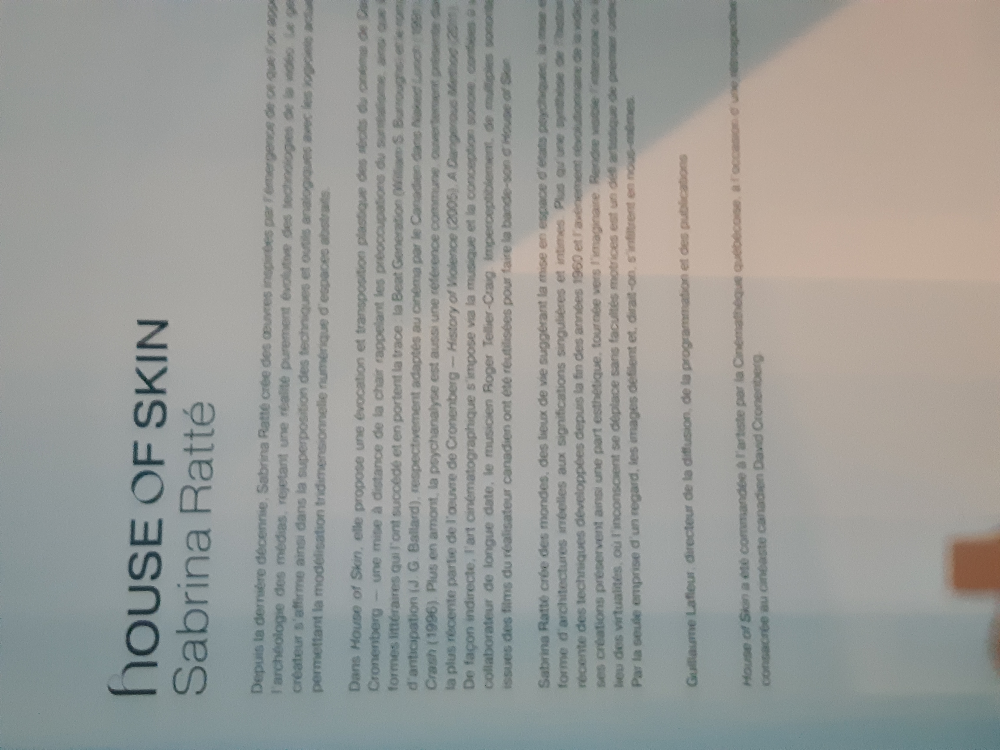
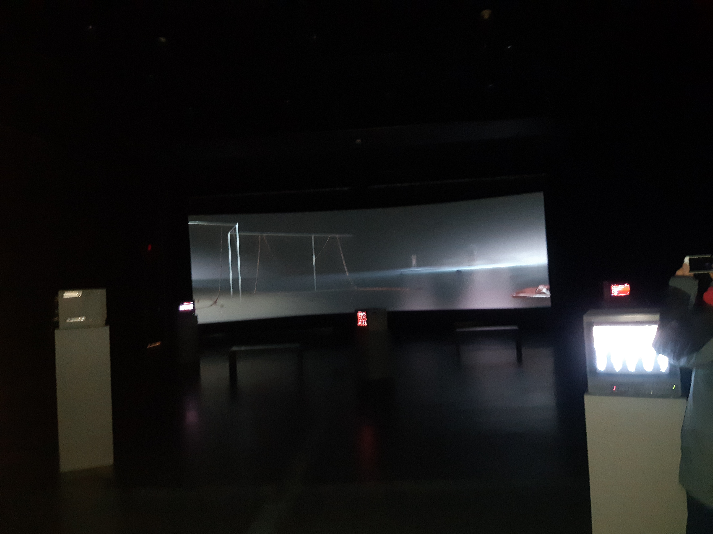

# *House of Skin*

## Artistes

Sabrina Ratté et Roger Teller-Craig

## Année de réalisation

2020

## Date de visite

03/02/22

## Lieu d'exposition

Cinémathèque Québécoise

## Description

*House of Skin* est une oeuvre mettant en scène une vidéo de 10 minutes dans laquelle on voit des rendus en 3 dimensions de ce qu'on peut assumer être de la chair humaine
ayant vécu des choses inimaginables. Cette vidéo peut être décrite comme "gore".

